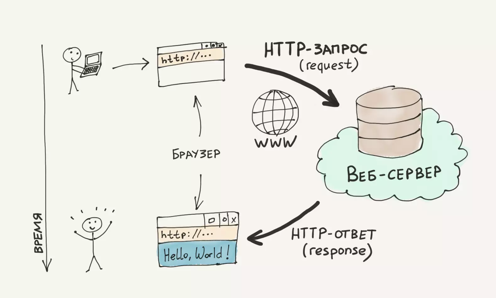
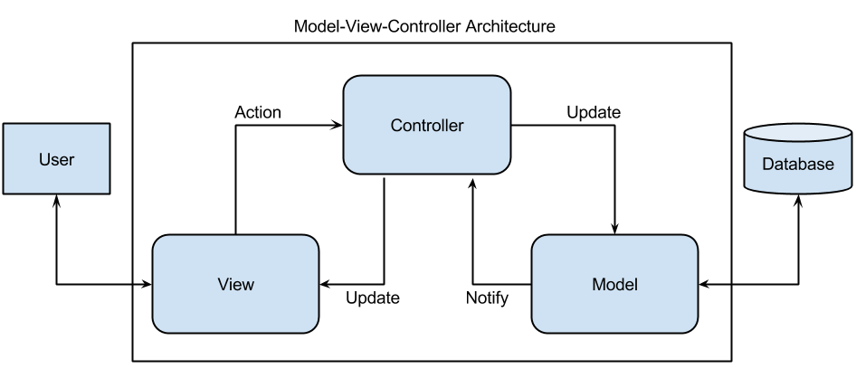
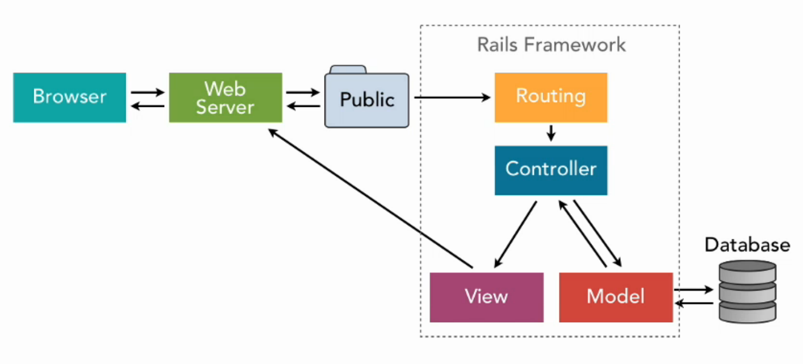
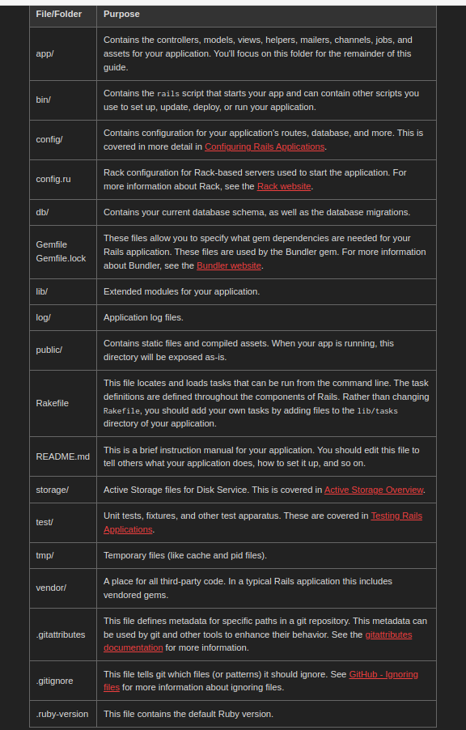

Rails
========================
Как работает взаимодействие типа клиент-сервер

Пользователь (клиент) может ввести в браузере какой-либо сайт (иначе http-запрос) и он отправится на веб-сервер, задача которого прослушивать обращения к себе и обрабатывать взаимодействие (давать какую-либо информацию). 

Что такое RoR (Ruby on Rails)? Это фреймворк языка ruby, который использует концепцию MVC.

MVC расшифровывается как «модель-представление-контроллер» (model-view-controller). Это способ организации кода, (или подход к проектированию приложения) который предполагает выделение блоков, отвечающих за решение разных задач. Один блок отвечает за данные приложения, другой отвечает за внешний вид, а третий контролирует работу приложения. 

Компоненты MVC:

1. Модель — этот компонент отвечает за данные, а также определяет структуру приложения. Например, если вы создаете To-Do приложение, код компонента model будет определять список задач и отдельные задачи.
2. Представление — этот компонент отвечает за взаимодействие с пользователем. То есть код компонента view определяет внешний вид приложения и способы его использования.
3. Контроллер — этот компонент отвечает за связь между model и view. Код компонента controller определяет, как сайт реагирует на действия пользователя. По сути, это мозг MVC-приложения.

Структура (стандартная) rails проекта

---
 Active Record это M в MVC - модель - которая является слоем в системе, ответственным за представление бизнес-логики и данных. Active Record упрощает создание и использование бизнес-объектов, данные которых требуют персистентного хранения в базе данных. Сама по себе эта реализация паттерна Active Record является описанием системы ORM (Object Relational Mapping).
 
 Object Relational Mapping (объектно-реляционное отображение), обычно упоминающееся как аббревиатура ORM, это техника, соединяющая сложные объекты приложения с таблицами в системе управления реляционными базами данных. С помощью ORM, свойства и взаимоотношения этих объектов приложения могут быть с легкостью сохранены и получены из базы данных без непосредственного написания выражений SQL, и, в итоге, с меньшим суммарным кодом для доступа в базу данных.
 
 Active Record предоставляет несколько механизмов, наиболее важными из которых являются способности для:

1. Представления моделей и их данных.
2. Представления связей между этими моделями.
3. Представления иерархий наследования с помощью связанных моделей.
4. Валидации моделей до того, как они станут персистентными в базе данных.
5. Выполнения операций с базой данных в объектно-ориентированном стиле.
 
 При написании приложения с использованием других языков программирования или фреймворков часто требуется писать много конфигурационного кода. В частности, это справедливо для фреймворков ORM. Однако, если следовать соглашениям, принятым Rails, вам придется написать совсем немного конфигураций (а иногда совсем не придется) при создании моделей Active Record. Идея в том, что в большинстве случаев вы настраиваете свои приложения одинаковым образом, и этот способ должен быть способом по умолчанию. Таким образом, явная конфигурация потребуется только тогда, когда вы не следуете соглашениям по какой-то причине.
 
 Соглашения по именованию.
 По умолчанию Active Record использует некоторые соглашения по именованию чтобы узнать, как должна быть создана связь между моделями и таблицами базы данных. Rails образует множественное число для имен класса, чтобы найти соответствующую таблицу базы данных. Так, для класса Book следует создать таблицу базы данных с именем books. Механизмы образования множественного числа Rails очень мощные, они способны образовывать множественное (и единственное) число как для правильных, так и для неправильных форм слов. При использовании имен класса, созданных из двух и более слов, имя класса модели должно следовать соглашениям Ruby, используя форму CamelCase, тогда как имя таблицы должно использовать форму snake_case. Примеры:

1. Класс модели - Единственное число с первой прописной буквой в каждом слове (т.е., BookClub).
2. Таблица базы данных - Множественная форма со словами, разделенными знаком подчеркивания (т.е., book_clubs).

Модель / Класс	Таблица / Схема
Article                    articles
LineItem               line_items
Deer	                        deers
Mouse	                    mice
Person                    	people
 
Соглашения схемы
Active Record использует соглашения о именовании для столбцов в таблицах базы данных, зависящих от назначения этих столбцов.

Внешние ключи - Эти поля должны именоваться по образцу singularized_table_name_id (т.е., item_id, order_id). Это поля, которые ищет Active Record при создании связей между вашими моделями.
Первичные ключи - По умолчанию Active Record использует числовой столбец с именем id как первичный ключ таблицы (bigint для PostgreSQL и MySQL, integer для SQLite). Этот столбец будет автоматически создан при использовании миграций Active Record для создания таблиц.
Также имеются некоторые опциональные имена столбцов, добавляющие дополнительные особенности для экземпляров Active Record:

created_at - Автоматически будут установлены текущие дата и время при изначальном создании записи.
updated_at - Автоматически будут установлены текущие дата и время всякий раз, когда создается или обновляется запись.
lock_version - Добавляет оптимистическую блокировку к модели.
type - Указывает, что модель использует Single Table Inheritance.
(association_name)_type - Хранит тип для полиморфных связей.
(table_name)_count - Используется для кэширования количества принадлежащих по связи объектов. Например, столбец comments_count в классе Article, у которого может быть несколько связанных экземпляров Comment, закэширует количество существующих комментариев для каждой статьи.
 
 CRUD это сокращение для четырех глаголов, используемых для описания операций с данными: Create (создать), Read (прочесть), Update (обновить) и Delete (удалить). Active Record автоматически создает методы, позволяющие приложению читать и воздействовать на данные, хранимые в своих таблицах.
 
 все происходит с создания модели rails generate model task body:text user_id:integer

rails db:migrate  создать базу данных с моделью. Миграции - код, который меняет БД под нужды приложения (one at time). Отражается в файле db/migrate
rails db:rollback откатить миграцию

rails console

sqlite3 через это можно взаимодействовать с дб

Task.create(body: "Do something", user_id: 1)

Task.find(1)

---

что такое контроллер? 
что такое генератор? rails g controller tasks
что такое пути? rails routes
http запрос и его метода
структура URL
params
REST

---

шаблоны (view) шаблонизатор erb
@переменную в шаблонизатор
routes, view helpers 
страница отдельной задачи
все задачи

---

form helper
redirect_to
безопасная обработка запросов
layouts
before_action
assets pipeline
font awesome
rails helper

---

1. создание модели rails generate task body:text user_id:integer
2. rails db:migrate (создание таблицы по модели). sqlite3 db/development.sqlite откроет менеджер таблиц, .tables выведет все таблицы
3. rails generate controller tasks
4. routes.rb меняется на post "/tasks", to: "questions#create" если на путь задач попадет пользователь его перенаправят на контроллер вопросов, метод создания + добавляется patch "/tasks/:id", to: "tasks#update" + delete "/tasks/:id", to: "tasks#destroy"

